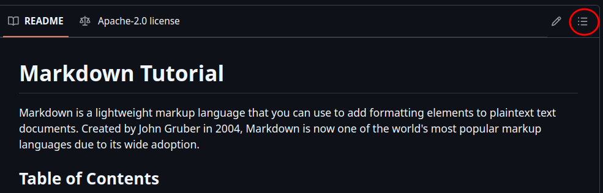

# Markdown Tutorial

Markdown is a lightweight markup language that you can use to add formatting elements to plaintext text documents. Created by John Gruber in 2004, Markdown is now one of the world's most popular markup languages due to its wide adoption.

## Table of Contents


1. [Headers](#headers)
    - [Subheaders](#subheaders)
2. [Lists](#lists)
3. [Links](#links)
4. [Images](#images)
5. [Text Formatting](#text-formatting)
    - [Bold Text](#bold-text)
    - [Italic Text](#italic-text)
    - [Strikethrough Text](#strikethrough-text)
6. [Blockquotes](#blockquotes)
7. [Code Blocks](#code-blocks)
8. [Horizontal Rules](#horizontal-rules)
9. [Tables](#tables)
10. [Files](#files)
11. [Dropdowns](#dropdowns)

**Note**: This is a sample table of contents. However, it is not necessary to have a table of contents in your *GitHub readme* as it will be automatically generated if you apply the *correct headers*.

<details>
<summary><b>Click to see screenshot</b></summary>



</details>


## Links

Links are created using the `[text](link)` format.

```markdown
[Link](https://example.com)
```

## Images

Images are created using`` format.

```markdown

```

*Note 1:* Remember to add the `alt` attribute to the image tag.
*Note 2:* The image path should be relative to the current file.

## Text Formatting

Text formatting includes bold, italic, strikethrough, and inline code.

### Bold Text

Bold text is created using the `**` symbol.

*Example:* **bold text**

---
*Code:*

```markdown
**bold text**
```

### Italic Text

Italic text is created using the `*` symbol.

*Example:* *italic text*

---
*Code:*

```markdown
*italic text*
```

### Strikethrough Text

Strikethrough text is created using the `~~` symbol.

*Example:* ~~strikethrough text~~

---
*Code:*

```markdown
~~strikethrough text~~
```

## Blockquotes

Blockquotes are created using the `>` symbol.


*Example:*
> Blockquote

---
*Code:*

```markdown
> Blockquote
```


## Code Blocks

### Inline Code

Inline code is created using the `inline code` format.

*Example:*
`git status`

---
*Code:*

```markdown
`git status`
```

### Code Blocks

Code blocks are created using the ````code```` format.

Code blocks can be written in multiple languages.

*Example:*

```python
print("Hello, World!")
```

---
*Code:*

```markdown
    ```python
    print("Hello, World!")
    ```
```

---

*Example:*

```css
.navbar {
  background-color: #333;
  color: white;
}
```

---
*Code:*


```markdown
    ```css
    .navbar {
      background-color: #333;
      color: white;
    }
    ```
```

---

*Example:*

```javascript
console.log("Hello, World!");
```

---
*Code:*


```markdown
    ```javascript
    console.log("Hello, World!");
    ```
```

*Note:* if you want to add for command line, you can use the `code` tag.

*Example:*

```bash
python -c "print('Hello, World!')"
```

---
*Code:*

```markdown
    ```code
    python -c "print('Hello, World!')"
    ```
```

## Horizontal Rules

Horizontal rules are created using the `---` symbol.

*Example:*

---
*Code:*

```markdown
---
---
---
```

## Tables

Tables are created using the `|` symbol.

*Example:*

| Header 1 | Header 2 | Header 3 |
| -------- | -------- | -------- |
| Cell 1   | Cell 2   | Cell 3   |
| Cell 4   | Cell 5   | Cell 6   |


---
*Code:*
```markdown
| Header 1 | Header 2 | Header 3 |
| -------- | -------- | -------- |
| Cell 1   | Cell 2   | Cell 3   |
| Cell 4   | Cell 5   | Cell 6   |
```

*Note 1:* The number of `|` symbols in each row should match the number of columns in the table.

*Note 2:* You can add *images* and *other files* to the table cells as well as *links*, *lists* and *inline code*.


## Files

You can add files to your Markdown document using the `[]()` format.

```markdown
[File](file.txt)
```

```markdown
[User Journey](user-journey.pdf)
```

*Note 1:* The file path should be relative to the current file.

If you create a folder `documentation` in the root directory, you can use the `[User Journey](documentation/user-journey.pdf)` format to link to a folder.


*Example:*

[PEP8 Validation Personnel Application](documentation/pep8_validation_personnel.pdf)

*Code:*

```markdown
[PEP8 Validation Personnel Application](documentation/pep8_validation_personnel.pdf)
```

## Dropdowns

Dropdowns are created using `<details>` and `<summary>` tags.

*Example:*
<details>
<summary><b>Click to see screenshot</b></summary>
Hello, World!
</details>


---
*Code:*

```markdown
<details>
<summary><b>Click to see screenshot</b></summary>
Hello, World!
</details>
```

**Note:** [Markdown Syntax by daringfireball](https://daringfireball.net/projects/markdown/syntax#html)